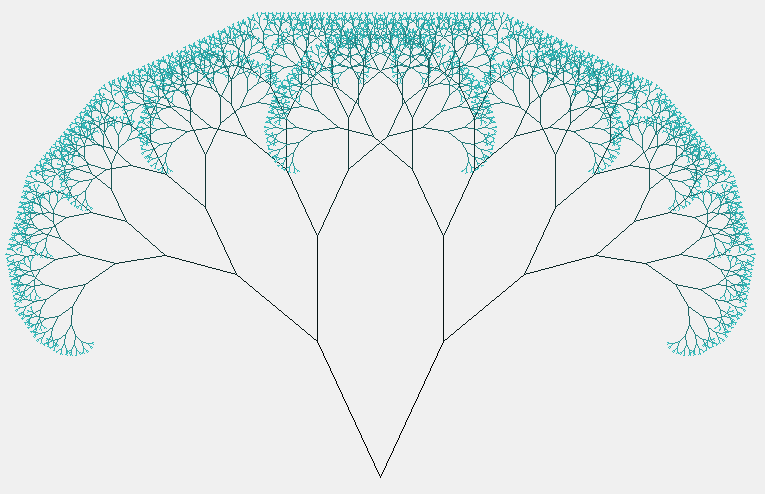

# Visual fractal tree

<details><summary><b> 1. What is this repository?</b></summary></br>

This is a python visual application that uses recursion to construct a colored fractal tree.

---
</details>

<details><summary><b> 2. What is a fractal?</b></summary></br>

A fractal is a figure with a repetitive pattern: a small part of it is similar to the entire figure, what is called self-similar.
This patterns can be found in nature, like in lightning bolts, snowflakes, Romanesco broccoli, frozen crystals and more.

---
</details>

<details>
<summary><b> 3. How to run the fractal tree?</b></summary></br>

1. You will need the Python3 installed, it can be found [here](https://www.python.org/downloads).
2. Download the file "Fractal-Tree.py" to a folder of your choice.
3. Open your founder using the terminal with this command (use the path to your folder):
    ```
    cd C:\Users\MyName\Documents\Myfolder\
    ```
4. Run the application with Python3:
    ```
    python Fractal-Tree.py
    ```

---
</details>

<details><summary><b> 4. How to edit and use it?</b></summary></br>

You can personalize your tree changing some variables in the code.
The variables, their functions and the respective lines in code are like following.</br>

Variable | Description | Recommendations | Line
---------| ----------- | --------------- | ----
branches | How many times a branch will diverge in new branches | Use a number between 9 and 15 | 11  
size | The length of the initials branches | High values will result in a tree bigger than the screen size | 12 |  
color | The branches' final color in RGB | Each value must be between 0 and 255 | 13 |  
l_angle_rate | Left branch relative angle  | Value in degrees; if the left and right angles are different, the tree will be asymmetric | 34 |  
r_angle_rate | Right branch relative angle | Value in degrees; if the left and right angles are different, the tree will be asymmetric | 35 |  
size_rate | Decreasing rate of the branches' size | Value between 0 and 1 will result in a decreasing size, 1 will result in a static size and values bigger than 1 will result in a crescent size of the branches | 36 
</br>

The default values will generate this symmetrical tree:


---
</details>

<details><summary><b> 5. Concepts used</b></summary></br>

+ Libraries imports
  + Graphics
  + Math
+ Graphical programming
+ Recursion

---
</details>


